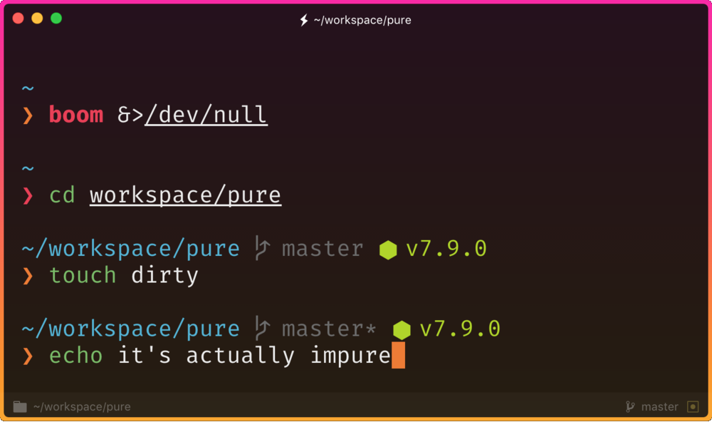

# impure

> Pretty, minimal and fast ZSH prompt




## Overview

Most prompts are cluttered, ugly and slow. I wanted something visually pleasing that stayed out of my way.

### Why?

- Comes with the perfect prompt character.
  Author went through the whole Unicode range to find it.
- Shows `git` branch and whether it's dirty (with a `*`).
- Indicates when you have unpushed/unpulled `git` commits with up/down arrows. *(Check is done asynchronously!)*
- Prompt character turns red if the last command didn't exit with `0`.
- Command execution time will be displayed if it exceeds the set threshold.
- Username and host only displayed when in an SSH session.
- Makes an excellent starting point for your own custom prompt.


## Install

Can be installed with `npm` or manually. Requires Git 2.0.0+ and ZSH 5.2+. Older versions of ZSH are known to work, but they are **not** recommended.

### npm

```console
$ npm install --global impure-prompt
```

That's it. Skip to [Getting started](#getting-started).

### Manually

1. Either…
  - Clone this repo
  - add it as a submodule, or
  - just download `impure.zsh` and `async.zsh`

2. Symlink `impure.zsh` to somewhere in [`$fpath`](http://www.refining-linux.org/archives/46/ZSH-Gem-12-Autoloading-functions/) with the name `prompt_impure_setup`.

3. Symlink `async.zsh` in `$fpath` with the name `async`.

#### Example

```console
$ ln -s "$PWD/impure.zsh" /usr/local/share/zsh/site-functions/prompt_impure_setup
$ ln -s "$PWD/async.zsh" /usr/local/share/zsh/site-functions/async
```
*Run `echo $fpath` to see possible locations.*

For a user-specific installation (which would not require escalated privileges), simply add a directory to `$fpath` for that user:

```sh
# .zshenv or .zshrc
fpath=( "$HOME/.zfunctions" $fpath )
```

Then install the theme there:

```console
$ ln -s "$PWD/impure.zsh" "$HOME/.zfunctions/prompt_impure_setup"
$ ln -s "$PWD/async.zsh" "$HOME/.zfunctions/async"
```


## Getting started

Initialize the prompt system (if not so already) and choose `impure`:

```sh
# .zshrc
autoload -U promptinit; promptinit
prompt impure
```


## Options

### `PURE_CMD_MAX_EXEC_TIME`

The max execution time of a process before its run time is shown when it exits. Defaults to `5` seconds.

### `PURE_GIT_PULL`

Set `PURE_GIT_PULL=0` to prevent impure from checking whether the current Git remote has been updated.

### `PURE_GIT_UNTRACKED_DIRTY`

Set `PURE_GIT_UNTRACKED_DIRTY=0` to not include untracked files in dirtiness check. Only really useful on extremely huge repos like the WebKit repo.

### `PURE_GIT_DELAY_DIRTY_CHECK`

Time in seconds to delay git dirty checking for large repositories (git status takes > 5 seconds). The check is performed asynchronously, this is to save CPU. Defaults to `1800` seconds.

### `PURE_PROMPT_SYMBOL`

Defines the prompt symbol. The default value is `❯`.

### `PURE_GIT_DOWN_ARROW`

Defines the git down arrow symbol. The default value is `⇣`.

### `PURE_GIT_UP_ARROW`

Defines the git up arrow symbol. The default value is `⇡`.


## Tips

In the screenshot you see impure running in [Hyper](https://hyper.is) with the [hyper-snazzy](https://github.com/sindresorhus/hyper-snazzy) theme and Fira Code font.

*Just make sure you have anti-aliasing enabled in your terminal.*

To have commands colorized as seen in the screenshot, install [zsh-syntax-highlighting](https://github.com/zsh-users/zsh-syntax-highlighting).


## Integration

### [oh-my-zsh](https://github.com/robbyrussell/oh-my-zsh)

1. Symlink (or copy) `impure.zsh` to `~/.oh-my-zsh/custom/impure.zsh-theme`.
2. Symlink (or copy) `async.zsh` to `~/.oh-my-zsh/custom/async.zsh`.
3. Set `ZSH_THEME="impure"` in your `.zshrc` file.

Or skip the `oh-my-zsh` integration above and simply:

1. Set `ZSH_THEME=""` in your `.zshrc` to disable oh-my-zsh themes.
2. Follow the impure [Install](#install) instructions.


## Original work done by

[Sindre Sorhus](http://sindresorhus.com) | [Mathias Fredriksson](https://github.com/mafredri)


## License

MIT © Federico Giovagnoli
